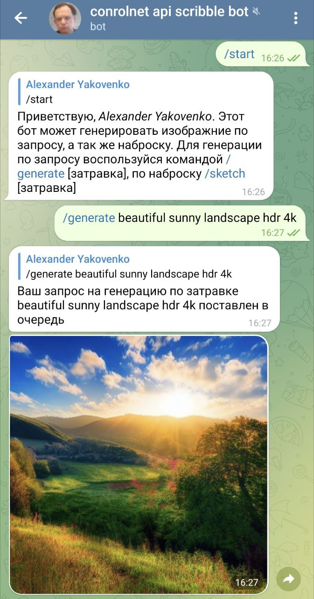
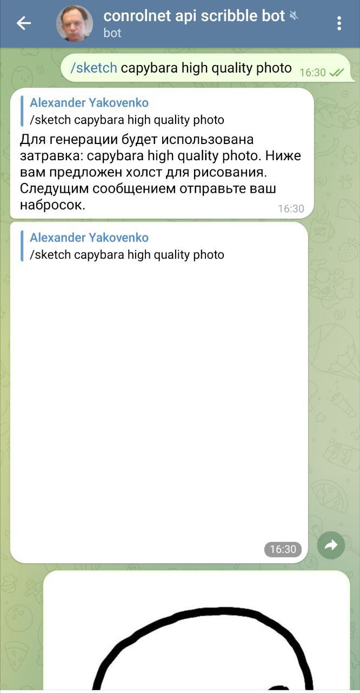
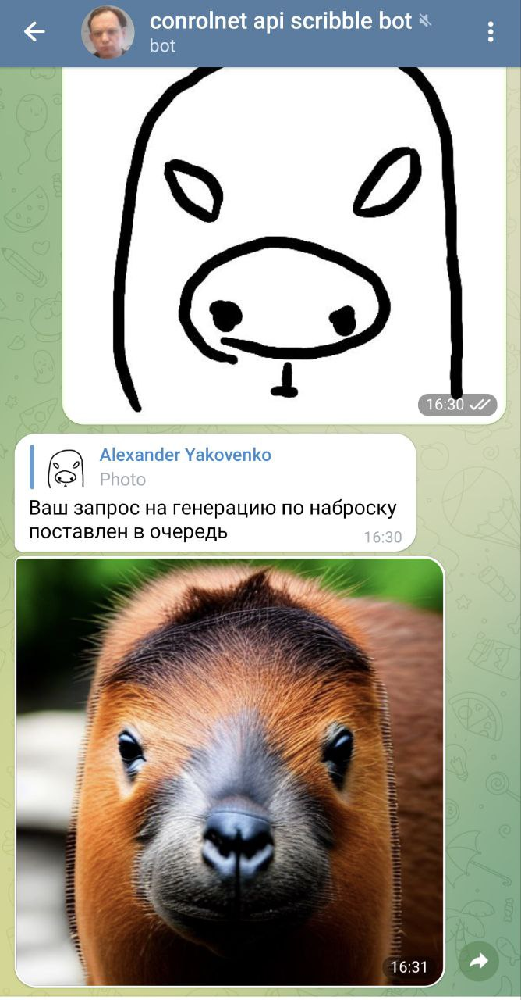

# Generative model Telegram Bot
Телеграм бот для вазимодействия с генеративными моделями изображений и текстов.

## Внешние зависимости / используемые технологии:
* [ControlNet](https://github.com/lllyasviel/ControlNet) для генерации изображений по скетчу / другой затравке
* [Telegram Bot API](https://core.telegram.org/bots/api) для построения бота

## Интерфейс
Взаимодействие с ботом происходит через обычный чат в Телеграме, в котором доступны следующие команды:  
`/generate prompt` -- сгенерировать изображение по текстовому описанию  
`/describe prompt` -- предложить более подробные варианты текстового описания  
`/sketch [prompt]` -- бот присылает белое изображение, которое затем посредством редактирования изображений в самом телеграме отправляется обратно боту для обработки. `prompt` -- текстовый запрос к модели  
`/change_prompt prompt` -- перегенерировать изображение с обновленным текстовым запросом  
`/update_sketch` -- возвращает предыдущий отправленные скетч и предлагает обновить его  

## Пример работы
| Генерация по запросу                     | Генерация по скетчу                           | Отправка скетча                              |
|------------------------------------------|-----------------------------------------------|----------------------------------------------|
|  |  |  |

## Сборка
Для построения документации:
```bash
doit html
```
Сгенерированная документация будет лежать в `docs/_build`

## Перед коммитом
1. Убедиться, что тесты успешно выполняются
2. Проверить, что все линтеры не выдают ошибок
```bash
doit check
```

## Запуск приложения
```bash
pipenv install
pipenv shell
doit app
```