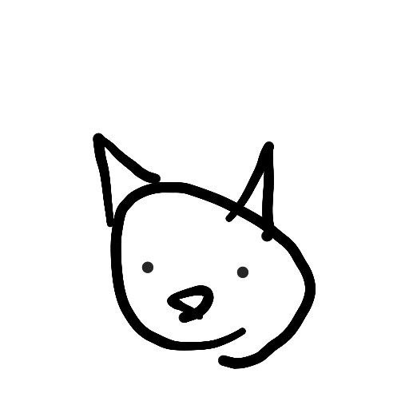

.. Generative model Telegram Bot documentation master file, created by
   sphinx-quickstart on Sat Apr 29 21:12:55 2023.
   You can adapt this file completely to your liking, but it should at least
   contain the root `toctree` directive.

Welcome to Generative model Telegram Bot's documentation!
=========================================================

.. |output| image:: ../assets/output_result.jpg
   :scale: 50%
   :align: middle

+--------------+---------------+
| Input Sketch | Output result |
+--------------+---------------+
|    |input|   |    |output|   |
+--------------+---------------+

This is the developer documentation to the source code of the bot.

The bot features currently include:

#. Image generation conditioned on text and, optionally, on other images.
#. Multiple concurrent generations are possible.

.. toctree::
   :maxdepth: 2
   :caption: Contents:

   build
   modules
   testing

Indices and tables
==================

* :ref:`genindex`
* :ref:`modindex`
* :ref:`search`
